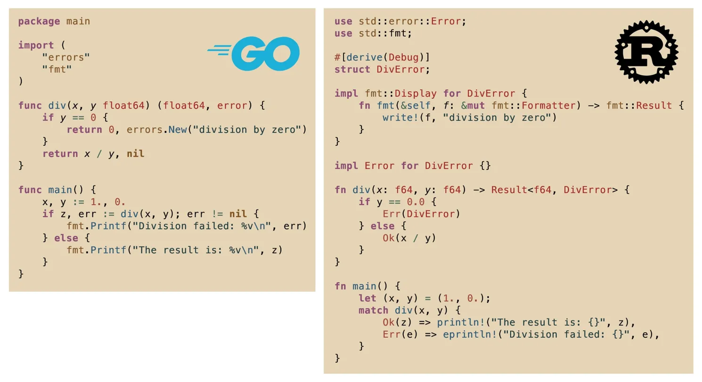

# Cross-Language Performance Benchmark

A comprehensive performance comparison across 24+ programming languages, inspired by an X (Twitter) post comparing Go and Rust error handling implementations.

This project was generated entirely using Claude Code with Claude 4 Opus. It has not been evaluated by experts in any of the languages. If you find errors, please submit a PR!

Keep in mind, this is a single test case with results from a single machine. This repo proves nothing, unless you need to know how efficiently different languages perform 100 million division ops on your local machine.



> **Project by [@typicalfo](https://x.com/typicalfo)** • [Original Response Tweet](https://x.com/typicalfo/status/1931195695123345408)

## 🚀 Overview

This project benchmarks functionally equivalent division functions with error handling across multiple programming languages to compare performance characteristics and idiomatic patterns. Each implementation handles division by zero using the language's recommended error handling approach.

## 📊 Languages Covered

Language | Error Handling Pattern | Category
--- | --- | ---
🐹 **Go** | Error interface pattern | Popular
🦀 **Rust** | Result<T, E> pattern | Popular  
🟨 **JavaScript** | Try/catch with custom Error | Popular
🐍 **Python** | Custom Exception classes | Popular
☕ **Java** | Exception handling | Popular
⚡ **C++** | Exception classes with std::runtime_error | Popular
🔧 **C** | Return codes with output parameters | Popular
💜 **C#** | Exception handling with custom classes | Popular
🎭 **Haskell** | Either type for functional error handling | Functional
🐪 **OCaml** | Exception-based error handling | Functional
💎 **Ruby** | StandardError inheritance | Dynamic
🌙 **Lua** | pcall error handling | Dynamic
⚡ **LuaJIT** | FFI optimization with pcall | High-Performance
🍎 **Swift** | Error protocol with do-catch | Modern
🏗️ **Kotlin** | Exception handling (JVM-based) | JVM
🎯 **Scala** | Try/Success/Failure pattern | JVM/Functional
🐪 **Perl** | eval-based error handling | Dynamic
🐘 **PHP** | Exception classes | Web
🏎️ **D** | Custom exception classes | Systems
⚡ **Zig** | Error unions and explicit error handling | Systems
🚀 **V** | Option types and error propagation | Systems
🔷 **Odin** | Enum-based error codes | Systems
🟦 **TypeScript (Bun)** | Try/catch optimized for Bun | High-Performance
🟨 **JavaScript (Bun)** | Error handling optimized for Bun | High-Performance
🧠 **Brainfuck** | Esoteric demonstration | Esoteric

## 🏃‍♂️ Quick Start

### Option 1: Docker (Recommended)

Test all languages with zero setup:

```bash
cd docker
docker-compose up --build
```

View results:
```bash
cat docker/results/test_results.txt
```

### Option 2: Local Development

Requires individual language toolchains. See [CLAUDE.md](CLAUDE.md) for detailed setup instructions.

```bash
# Example: Go
go run div.go

# Example: Rust  
cargo run --bin main
```

## 🔧 Architecture

Each implementation follows the same pattern:
1. **Division function** that returns appropriate error for division by zero
2. **Error handling** using language-specific idiomatic patterns
3. **Main function** demonstrating both success and error cases
4. **Consistent behavior** across all languages

## 🎯 Benchmarking

The project includes benchmarking tools to measure:
- **Execution time** across iterations
- **Memory usage** patterns
- **Error handling overhead**
- **Language-specific optimizations**

Run benchmarks:
```bash
./run_benchmark.sh
```

## 📈 Results

Performance characteristics vary significantly across languages due to:
- **Compilation vs interpretation**
- **Error handling mechanisms** (exceptions vs return values)
- **Runtime optimizations**
- **Memory management** strategies

## 🤝 Contributing

This project demonstrates cross-language patterns. When contributing:
- Maintain functional equivalence across implementations
- Use idiomatic error handling for each language
- Ensure consistent behavior and output
- Update benchmarks for new languages

## 📝 License

Open source project for educational and benchmarking purposes.

---

*Inspired by the ongoing discussion about programming language performance and error handling patterns in the developer community.*

**Credits:**
- Original concept from [@kai_fall](https://x.com/kai_fall)'s X post comparing Go vs Rust
- Implementation and expansion by [@typicalfo](https://x.com/typicalfo) using Claude Code w/ Claude Opus 4
- Community contributions welcome!
